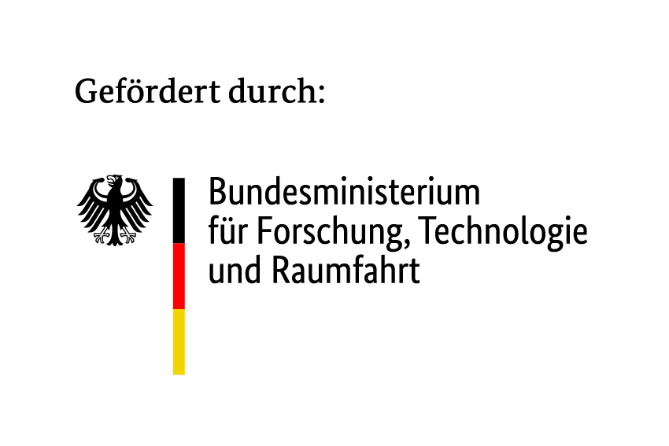

<!--

author: Mathias Zinnen (FAU/SODa)

comment: Einführung in die Umgebungsverwaltung mit Python und Pip
date: 2026-03-16
version: 0.0.1
email: mathias.zinnen@fau.de


mode: Textbook
dark: false
edit: https://github.com/soda-collections-objects-data-literacy/2D_HowToPip

link:       https://cdn.jsdelivr.net/gh/soda-collections-objects-data-literacy/OpenRefine-Beginner-Tutorial@main/theme.css
            https://fonts.googleapis.com/css?family=Noto+Sans


icon:       /res/SODa-Logo_Wort-Bild_RGB.png
logo:       /res/SODa-Logo_Wort-Bild_RGB.png

language: de

comment: Dieses Dokument ist einer Einführung zur Umgebungsverwaltung und zum Paketmanagement in Python. Es richtet sich insbesondere an Sammlungsverantwortliche mit geringen technischen Vorkenntnissen.

-->

# SODa Einführung in die Umgebungsverwaltung mit Python und Pip

Ob in der Digitalisierung, Objektforschung oder Texterfassung -- Open Source Software kann teure kommerzielle Angebote häufig ersetzen. 
Dabei sind die Voraussetzungen die nötig sind, um solche Open Source Algorithmen auf lokalen Systemen lauffähig zu machen häufig geringer als erwartet. 
Dieses Tutorial soll die nötigen Grundlagen vermitteln, um das eigene System für die Ausführung solcher Algorithmen vorzubereiten. 
Nacheinander werden dazu der Umgang mit der Kommandozeile, die Installation einer lokalen Python Umgebung, die Umgebungsverwaltung und -Isolation mit venv, sowie das Paketmanagement mit Pip behandelt. 
Am Ende der Einheit sind Nutzer:innen in der Lage, mit wenig Aufwand Open Source Projekte von Plattformen wie GitHub oder Pip lokal auszuführen. 

Lernziele: 
- [Umgang mit der Kommandozeile](#3)
- [Installation einer Python Umgebung](#5)
- [Umgebungsverwaltung mit Venv](#6)
- [Paketmanagement mit Pip](#7)

Das Tutorial ist angelehnt an zwei SODa Präsenzworkshops: ["Python, GitHub, Pip & Co"](https://sammlungen.io/events/soda-workshop-python-github-pip-co) sowie die einführenden Teile des Workshops zur [Objekterkennung](https://sammlungen.io/events/workshop-automatisierte-objekterkennung-der-sammlungsarbeit). 
Entsprechend der Zielsetzung des SODa Projekts stellen Sammlungsverantwortliche und mit Sammlungsdaten Forschende die primäre Zielgruppe dar, grundsätzlich kann das Tutorial aber natürlich von allen genutzt werden.
Der Quelltext ist auf GitHub [veröffentlicht](https://github.com/soda-collections-objects-data-literacy/2D_HowToPip) und frei nachnutzbar. Über Feedback und Verbesserungsvorschläge, z.B. per [Mail](mailto:mathias.zinnen@fau.de), freuen wir uns sehr!

## Einführung

Warum sollte ich mir überhaupt die Mühe machen, mich in die Kommandozeile und Python Umgebungsverwaltung einzuarbeiten? Es gibt doch onlinedienste wie google colab, verschiedene Jupyterhubs oder den [SODa Semantic Coworking Space](https://sammlungen.io/semantic-coworking-space)? 
Es kommt darauf an, was man erreichen möchte. 
Um ein erstes Verständnis für Machine-Learning und Data Science Inhalte zu entwickeln, reicht es tatsächlich häufig aus, remote gehostete Notebooks durchzuarbeiten. 
Ein gutes Beispiel dafür sind etwa die Online Workshops unserer Kolleg:innenen von [WiNoDa](https://winoda.de/), die ihre tollen Video Kurse auf [YouTube](https://www.youtube.com/@WiNoDaKnowledgeLab) häufig mit vorbereiteten Google Colab Notebooks unterstützen, so dass die Teilnehmer:innen die Lerninhalte direkt interaktiv ausprobieren können. 
Um Python auszuprobieren und programmatisch auf eigene WissKI Instanzen zugreifen zu können, kann etwa der momentan noch im Aufbau befindliche SODa Semantic Coworking Space verwendet werden.
Hier verfolgen wir allerdings bewusst einen anderen Ansatz: Wer lernt, grundlegend mit der Kommandozeile umzugehen, sich mit der Umgebungsverwaltung und dem Paketmanagement grundsätzlich vertraut macht und vor allem, lernt das Ganze auf dem **eigenen** System einzurichten, besitzt volle Autonomie über die eigenen Daten und digitalen Fähigkeiten. 
Keine spontane Serviceabschaltung, Änderung des Geschäftsmodells oder politische Instabilität betrifft diejenigen, die Software mit offenem Quellcode auf ihren eigenen Systemen installiert haben. 
Am Ende ist es natürlich eine Abwägung: Manchmal ist es einfach nicht möglich, Zeit und personelle Ressourcen aufzubringen. Wir möchten aber dennoch dafür werben und unterstützen mit dem SODa Helpdesk gerne bei Problemen in der Umsetzung.  
Aufbauend auf diesem Tutorial planen wir weitere Vertiefungsmodule, in denen Beispielprojekte lokal installiert und genutzt werden, etwa zur Objekterkennung mit YOLO, Textverarbeitung mit SpaCy, oder Texterkennung mit EasyOCR. 

Sobald es konkret wird unterscheiden sich die nötigen Schritte je nach Betriebssystem. Einfach das Kontextmenü für das jeweilige Betriebssystem ausklappen. 
Die pro Einheit erlernten Befehle sind jeweils noch einmal im Kapitel [TLDR](#35) kurz zusammengefasst. 

## Kommandozeile

Die Kommandozeile (oft auch Terminal oder Konsole genannt) ist eine rein textbasierte Möglichkeit, mit dem eigenen Betriebssystem zu interagieren. 
Da die meisten modernen Betriebssysteme standardmäßig über grafische Oberflächen (mit Maus und Fenstern) gesteuert werden, kann man einen Computer jahrelang nutzen, ohne jemals mit der Kommandozeile in Berührung zu kommen. 
Für die Ausführung von Python-Skripten, das Installieren von Softwarepaketen oder die Automatisierung von Routineaufgaben ist die Kommandozeile jedoch das mächtigere und oft direktere Werkzeug. Im Folgenden schauen wir uns an, wie wir dieses Werkzeug aufrufen und uns darin bewegen.

### Kommandozeile öffnen
-----------------------
Der erste Schritt ist das Öffnen des entsprechenden Programms. Hier unterscheiden sich die konkreten Schritte je nach Betriebssystem. 

<details>
<summary>Windows (PowerShell)</summary>

Unter Windows nutzen wir die **PowerShell**, da sie moderner und leistungsfähiger ist als die alte Eingabeaufforderung (cmd).
1. Drücken Sie die Windows-Taste auf Ihrer Tastatur (oder klicken Sie unten in der Taskleiste auf das Start-Symbol / die Lupe).
2. Tippen Sie das Wort `powershell` ein.
3. Klicken Sie auf das Suchergebnis **Windows PowerShell**, um das Programm zu öffnen. Es öffnet sich ein Fenster mit einem meist blauen oder schwarzen Hintergrund und einem blinkenden Cursor.
</details>

<details>
<summary><b>MacOS (Terminal)</b></summary>

Auf dem Mac ist die App **Terminal** bereits vorinstalliert.
1. Öffnen Sie die Spotlight-Suche. Drücken Sie dafür gleichzeitig die Tasten `[cmd] + [Leertaste]`.
2. Tippen Sie das Wort `Terminal` in das Suchfeld ein.
3. Drücken Sie `[Enter]` oder klicken Sie auf das Suchergebnis, um das Terminal zu starten. Ein Fenster mit weißem oder schwarzem Hintergrund und einem blinkenden Cursor öffnet sich.
</details>

<details>
<summary><b>Linux (Terminal)</b></summary>

1. In den meisten gängigen Linux-Distributionen (wie Ubuntu) können Sie das Terminal ganz einfach über die Tastenkombination `[Strg] + [Alt] + [T]` öffnen.
2. Alternativ finden Sie es im Anwendungsmenü unter dem Namen **Terminal** oder **Konsole**.
</details>

### Navigation und das Arbeitsverzeichnis

Sobald Sie die Kommandozeile geöffnet haben, befinden Sie sich immer an einem bestimmten virtuellen Ort auf Ihrem Computer. Das ist wie in einem physischen Museumsdepot oder Archiv: Sie stehen immer in einem konkreten Raum vor einem bestimmten Regal, auch wenn Sie theoretisch Schlüssel für das ganze Gebäude haben. 

Dieser "Raum" wird als Current Working Directory (CWD), also das aktuelle Arbeitsverzeichnis, bezeichnet. Das CWD bestimmt, an welchem Ort im Dateisystem Ihre Befehle ausgeführt werden. Wenn Sie beispielsweise den Befehl geben "Lege hier einen neuen Ordner an", passiert das genau in Ihrem CWD.

Um sich durch die Verzeichnisse zu bewegen, müssen Sie dem System den Weg beschreiben. Das tun wir über sogenannte Pfade. Hier gibt es zwei wichtige Konzepte zu unterscheiden:

**1. Absolute Pfade (Die vollständige Adresse)**
Ein absoluter Pfad ist wie eine exakte postalische Anschrift. Er beginnt immer ganz oben an der Wurzel Ihres Dateisystems (z.B. bei `C:\ ` unter Windows oder `/` bei MacOS/Linux) und beschreibt den exakten Weg bis zur Zieldatei. Ein absoluter Pfad funktioniert immer, egal in welchem CWD Sie sich gerade befinden.
* Beispiel Windows: `C:\Benutzer\Name\Dokumente\Projekt`
* Beispiel Mac/Linux: `/Users/Name/Documents/Projekt`

**2. Relative Pfade (Die Wegbeschreibung von Ihrem Standort aus)**
Ein relativer Pfad ist wie die Anweisung "Gehe den Gang hinunter und nimm die zweite Tür links". Er geht immer von Ihrem aktuellen Arbeitsverzeichnis (CWD) aus.
* Wenn Sie im Ordner `Dokumente` sind und in den Unterordner `Projekt` möchten, reicht der relative Pfad: `Projekt` (oder `./Projekt`).
* Um einen Ordner nach oben zu gehen (quasi den aktuellen Raum zu verlassen und auf den Flur zu treten), nutzt man in der Kommandozeile immer zwei Punkte: `..`

#### Die wichtigsten Befehle zur Navigation

Probieren Sie doch direkt einmal in Ihrer geöffneten Kommandozeile aus, sich umzusehen:

* **Wo bin ich?** Geben Sie `pwd` (Mac/Linux) oder `Get-Location` (Windows PowerShell) ein und drücken Sie Enter. Das System zeigt Ihnen Ihr aktuelles CWD an.
* **Was ist hier?**
  Geben Sie `ls` ein und drücken Sie Enter. Das listet alle Dateien und Unterordner an Ihrem aktuellen Standort auf.
* **Wie wechsle ich den Raum?**
  Nutzen Sie den Befehl `cd` (change directory) gefolgt von einem Leerzeichen und dem Pfad. Zum Beispiel `cd Dokumente` (um in den Ordner Dokumente zu wechseln) oder `cd ..` (um einen Ordner nach oben zu gehen).

### Tipps & Tricks

Die Arbeit in der Kommandozeile wirkt anfangs oft mühsam, da jeder Buchstabe und jedes Leerzeichen exakt stimmen muss.
Zum Glück gibt es einfache Tricks, die Ihnen nicht nur den Großteil der Tipparbeit abnehmen, sondern auch frustrierende Tippfehler von vornherein verhindern.

#### Tab-Vervollständigung (Tab Completion)

Obwohl die Kommandozeile textbasiert ist, müssen sie bei weitem nicht alles selbst tippen. 
Hier kommt Ihr neuer bester Freund ins Spiel: Die Tabulatortaste (kurz Tab, befindet sich auf der Tastatur meist ganz links neben dem 'Q' und hat zwei entgegengesetzte Pfeile).

Wenn Sie anfangen, einen Ordner- oder Dateinamen einzutippen, und dann die Tab-Taste drücken, versucht die Kommandozeile, den Namen automatisch zu Ende zu schreiben. 

* Ein Beispiel: Stellen Sie sich vor, Sie haben einen Ordner namens `Sammlungsdaten_Export_2026`. Anstatt diesen langen Namen abzutippen (und sich dabei vielleicht zu vertippen), tippen Sie einfach `cd Samm` und drücken dann die `[Tab]`-Taste. 
* Die Kommandozeile vervollständigt den Befehl automatisch zu `cd Sammlungsdaten_Export_2026`.
* Gibt es mehrere Dateien, die mit "Samm" anfangen, können Sie die Tab-Taste mehrfach drücken, um durch die verschiedenen Möglichkeiten durchzuschalten.

Das funktioniert nicht nur für die vervollständigung von Datei- und Ordnernamen, sondern lässt sich auch in vielen weiteren Kontexten anwenden. Zum Beispiel lassen sich auch andere Konsolenbefehle automatisch vervollständigen, sobald genug Zeichen getippt sind, um das Kommando eindeutig zu identifizieren. Sollten noch nicht genug Zeichen getippt sein führt ein mehrmaliges Drücken der Tabulatortaste zu einer Anzeige der Optionen. Das ist sehr nützlich wenn man sich mal nicht genau an ein Kommando erinnern kann -- oder einfach keine Lust hat, so viel zu tippen! 


#### Befehlshistorie (Command History)

Niemand tippt gerne denselben langen Befehl zweimal ein. Auch hier nimmt Ihnen die Kommandozeile die Arbeit ab, denn sie merkt sich alle Befehle, die Sie in der aktuellen Sitzung eingegeben haben.

Um auf alte Befehle zuzugreifen, nutzen Sie einfach die **Pfeiltasten (Hoch und Runter)** auf Ihrer Tastatur:
* Drücken Sie die **Pfeil-nach-oben-Taste** (`[↑]`), um den zuletzt eingegebenen Befehl wieder aufzurufen.
* Drücken Sie sie mehrmals, um weiter in der Vergangenheit zurückzugehen.
* Sind Sie zu weit zurückgegangen? Mit der **Pfeil-nach-unten-Taste** (`[↓]`) springen Sie wieder einen Schritt vorwärts.

Sobald der gewünschte alte Befehl auf dem Bildschirm erscheint, können Sie ihn mit der `[Enter]`-Taste erneut ausführen oder ihn vorher mit der Löschen-Taste noch anpassen.

#### Ordner anlegen und löschen

Neben der reinen Navigation können Sie über die Kommandozeile natürlich auch Ihre Ordnerstruktur bearbeiten. Für unsere späteren Übungen ist es wichtig, dass Sie wissen, wie man neue "Räume" (Ordner) erschafft und wieder abreißt.

**1. Einen neuen Ordner anlegen (`mkdir`)**
Um in Ihrem aktuellen Arbeitsverzeichnis einen neuen Ordner zu erstellen, nutzen Sie den Befehl `mkdir` (steht für make directory), gefolgt von einem Leerzeichen und dem gewünschten Namen.
* Beispiel: `mkdir Forschungsprojekt_2026` 
* Wenn Sie danach `ls` eingeben, werden Sie sehen, dass der neue Ordner aufgetaucht ist.

**2. Einen Ordner löschen (`rm`)**
Um Dateien oder ganze Ordner zu löschen, wird der Befehl `rm` (remove) verwendet. Da ein Ordner weitere Dateien enthalten kann, müssen wir der Kommandozeile sagen, dass sie den Ordner und seinen gesamten Inhalt (rekursiv) löschen soll. Dafür hängen wir ein `-r` an den Befehl an.
* Beispiel: `rm -r Forschungsprojekt_2026`
* **Achtung:** Wenn Sie Dateien oder Ordner über die Kommandozeile löschen, landen diese in der Regel nicht im Papierkorb, sondern sind sofort unwiderruflich weg! Nutzen Sie diesen Befehl also mit Vorsicht.

### Quiz: Kommandozeilen-Führerschein

Lassen Sie uns kurz überprüfen, ob die wichtigsten Konzepte zur Navigation sitzen, bevor wir uns an die Installation von Python machen!

**Frage 1: Sie befinden sich im Ordner `Dokumente/Forschungsprojekt/Daten`. Welchen Befehl nutzen Sie, um genau einen Raum (Ordner) zurück nach `Forschungsprojekt` zu gehen?**

[( )] `cd Forschungsprojekt`
[( )] `cd /`
[(X)] `cd ..`
[( )] `ls`


**Frage 2: Sie möchten einen Befehl ausführen, den Sie vor fünf Minuten schon einmal fehlerfrei eingetippt haben. Was ist der effizienteste Weg?**

[( )] Ich tippe ihn vorsichtig und Zeichen für Zeichen neu ab.
[(X)] Ich drücke mehrmals die Pfeil-nach-oben-Taste `[↑]`, bis der Befehl wieder erscheint, und drücke Enter.
[( )] Ich drücke die `[Tab]`-Taste, damit die Kommandozeile errät, was ich vorhabe.


**Frage 3: Was passiert, wenn Sie den Befehl `ls` eingeben und Enter drücken?**

[( )] Die Kommandozeile wird geschlossen.
[(X)] Alle Dateien und Unterordner in meinem aktuellen Arbeitsverzeichnis (CWD) werden als Liste angezeigt.
[( )] Mein Computer sucht im Internet nach Updates.

#### Weiterführende Kommandozeilen-Einführungen

In diesem Tutorial haben wir nur an der absoluten Oberfläche der Kommandozeile gekratzt (Navigation mit `cd` und Auflisten mit `ls`). Wenn Sie lernen möchten, wie Sie zehntausende Dateien in Sekundenbruchteilen umbenennen, durchsuchen oder automatisierte Abläufe starten, finden Sie hier exzellente, speziell für Forschende und Geisteswissenschaftler:innen aufbereitete Einstiegshilfen:

* **[The Programming Historian](https://programminghistorian.org/):** Bietet hervorragende Einführungen, beispielsweise die (Introduction to the Windows Command Line with PowerShell)[https://programminghistorian.org/en/lessons/intro-to-powershell] oder (Introduction to the Bash Command Line)[https://programminghistorian.org/en/lessons/intro-to-bash].
* **[Library Carpentry - The UNIX Shell](https://librarycarpentry.org/lc-shell/):** Ein englischsprachiger, speziell für Bibliothekar:innen und Mitarbeitende an Sammlungen entwickelter Kurs. Er zeigt Schritt für Schritt die enorme Zeitersparnis der Kommandozeile bei der täglichen Datenverarbeitung.
* **[Ubuntuusers Wiki (Shell)](https://wiki.ubuntuusers.de/Shell/Einf%C3%BChrung/):** Für Nutzer:innen von Linux (und in weiten Teilen auch Mac) bietet dieses sehr verständliche, deutschsprachige Wiki einen tollen Einstieg in die tiefere Funktionsweise des Terminals.

## Python 

Python ist aktuell eine der beliebtesten Programmiersprachen der Welt. Besonders in der Wissenschaft, den Digital Humanities und bei der Arbeit mit großen Datenmengen (wie Sammlungsdaten) hat sie sich als Standard etabliert. Zwei Eigenschaften machen Python für unseren Anwendungszweck besonders interessant:

**1. Python ist eine interpretierte Sprache**
Bei vielen traditionellen Programmiersprachen (wie C++) wird der von Menschen geschriebene Code erst in ein fertiges, maschinenlesbares Programm übersetzt (kompiliert), bevor man es ausführen kann. Die fertige Datei (z.B. eine `.exe`) bringt dann alles mit, was sie zum Laufen braucht. 

Python funktioniert anders: Es ist eine interpretierte Sprache. Das bedeutet, der Programmcode bleibt als lesbarer Text erhalten. Er wird erst in dem Moment, in dem wir ihn starten, Zeile für Zeile von einem sogenannten Interpreter gelesen und direkt ausgeführt. 
Warum ist das wichtig? Weil ein Python-Skript (der Text) nicht für sich alleine lauffähig ist. Es bringt keinen eigenen Übersetzer mit. Um ein Python-Projekt von GitHub auf Ihrem Computer auszuführen, müssen wir also sicherstellen, dass auf unserem System der richtige Interpreter bereitsteht. Genau das macht das Thema Umgebungsverwaltung später so wichtig.

**2. Ein gigantisches Ökosystem an Paketen**
Niemand muss bei Null anfangen. Die weltweite Python-Community hat für fast jedes erdenkliche Problem bereits fertige Bausteine geschrieben, sogenannte Bibliotheken (Libraries) oder Pakete (Packages). Ob Sie Texte maschinell auswerten, automatische Objekterkennung in Bildern nutzen oder Metadaten aus Tabellen auslesen wollen: Es gibt dafür zehntausende vorgefertigte Pakete, die wir einfach in unser Projekt laden können. 

### Installation

Damit unser Computer Python-Code interpretieren kann, müssen wir Python zunächst installieren. Klappen Sie dafür die Anleitung für Ihr Betriebssystem auf:

<details>
<summary><b>Windows</b></summary>
1. Laden Sie den Python Install Manager von der offiziellen Website [Python.org](https://www.python.org/) herunter und führen Sie die Datei aus. Wichtig: Setzen Sie im allerersten Fenster des Installers unbedingt unten das Häkchen bei "Add Python to PATH"!
2. Um eine bestimmte installierte Version über das Terminal (PowerShell) aufzurufen, können Sie den Befehl `py -V:<VERSION>` nutzen, z.B. `py -V:3.11`.
</details>

<details>
<summary><b>MacOS</b></summary>

Auf dem Mac empfehlen wir die Installation über die Kommandozeile, um spätere Versionen leichter verwalten zu können.
1. Öffnen Sie Ihr Terminal.
2. Falls Sie Homebrew (einen beliebten Paketmanager für Mac) noch nicht installiert haben, folgen Sie kurz den Anweisungen auf [brew.sh](https://brew.sh/).
3. Wir nutzen das Tool `pyenv` zur Verwaltung der Versionen. Geben Sie ein: `brew install pyenv` und drücken Sie Enter.
4. Installieren Sie nun Python (z.B. Version 3.11) mit dem Befehl: `pyenv install 3.11`
</details>

<details>
<summary><b>Linux (z.B. Ubuntu)</b></summary>

Linux-Systeme bringen oft schon eine Python-Version mit oder lassen sich sehr einfach über den integrierten Paketmanager aktualisieren.
1. Öffnen Sie das Terminal.
2. Installieren Sie Python über den von ihnen verwendeten Paketmanager, z.B. unter ubuntu: `sudo apt update && sudo apt install python3`
</details>


### Quiz: Erkennt die Kommandozeile Python?

Lassen Sie uns direkt überprüfen, ob die Installation erfolgreich war und Ihr Computer den Interpreter nun kennt. 
Öffnen Sie Ihre Kommandozeile und geben Sie folgenden Befehl ein (und drücken Sie Enter):

* Unter Windows: `python --version` (falls das nicht klappt, probieren Sie `py --version`)
* Unter Mac/Linux: `python3 --version` (oder auch `python --version`)

**Was wird Ihnen in der Kommandozeile als Antwort (Output) ausgegeben?**

[( )] "Command not found" oder "Der Befehl 'python' ist entweder falsch geschrieben oder konnte nicht gefunden werden."
[(X)] Ein Text wie "Python 3.11.x" (oder eine ähnliche Versionsnummer).
[( )] Es passiert gar nichts, der Cursor blinkt einfach in der nächsten Zeile weiter.


### Ein erstes Python-Skript ausführen

Nun, da der Python-Interpreter installiert und über die Kommandozeile erreichbar ist, wollen wir ihn auch nutzen. Wie zu Beginn des Kapitels erklärt, liest Python reine Textdateien (sogenannte Skripte, erkennbar an der Dateiendung `.py`) und führt die darin enthaltenen Befehle aus. 

Je nach Betriebssystem und Installation starten Sie Skripte, indem Sie in der Kommandozeile den entsprechenden Aufrufbefehl (`python`, `py` oder `python3`) gefolgt von einem Leerzeichen und dem Namen der Skript-Datei eingeben. 

Lassen Sie uns das direkt ausprobieren:

1. Öffnen Sie ein einfaches Texteditor-Programm (z.B. den vorinstallierten *Editor* bzw. *Notepad* unter Windows oder *TextEdit* auf dem Mac). Bitte nutzen Sie hierfür kein Word, da dieses versteckte Formatierungen speichert!
2. Tippen Sie exakt diese eine Zeile ein: 
   `print("Look ma, I can python!")`
3. Speichern Sie die Datei unter dem Namen `hello.py` in einem Ordner Ihrer Wahl (z.B. in einem neuen Ordner namens `Python_Test` in Ihren Dokumenten).
4. Öffnen Sie Ihre Kommandozeile und navigieren Sie mit dem `cd`-Befehl (den wir vorhin kennengelernt haben) in genau diesen Ordner. Zur Erinnerung: Mit der `[Tab]`-Taste geht das viel schneller!
5. Führen Sie das Skript nun aus. Tippen Sie dafür (je nach System):
   `python hello.py` (oder `python3 hello.py` bzw. `py hello.py`) und drücken Sie Enter.

Wenn alles geklappt hat, liest der Interpreter nun Ihre Datei und gibt den Text `Look ma, I can python!` direkt in Ihrer Kommandozeile aus. Herzlichen Glückwunsch zu Ihrem ersten laufenden Python-Skript!

### Optional: Eine zweite Python-Version installieren (Multi-Python)

Manche Open-Source-Projekte benötigen ganz bestimmte, oft ältere Python-Versionen (z.B. Python 3.9), da sie mit der allerneuesten Version nicht mehr kompatibel sind. 

Die gute Nachricht: Sie können problemlos mehrere Python-Versionen gleichzeitig auf Ihrem Computer installieren, ohne dass diese sich in die Quere kommen! Später lernen wir, wie wir mit `venv` gezielt auswählen, welche dieser Versionen für ein Projekt genutzt werden soll.

Wenn Sie dieses "Multi-Python"-Szenario später in unseren Übungen ausprobieren möchten, können Sie sich jetzt testweise eine zweite, ältere Version (z.B. Version 3.9) installieren. Klappen Sie dafür die Anleitung für Ihr System auf:

<details>
<summary><b>Windows</b></summary>

Unter Windows macht uns der sogenannte "Python Launcher" (der kleine Helfer `py`, der bei der Erstinstallation automatisch mitinstalliert wurde) das Leben sehr leicht.
1. Gehen Sie auf [python.org/downloads](https://www.python.org/downloads/) und scrollen Sie nach unten zu den älteren Releases.
2. Suchen Sie nach der gewünschten Version (z.B. 3.9.13) und laden Sie den Windows-Installer herunter.
3. Führen Sie die Installation genau wie beim ersten Mal durch (auch hier das Häkchen bei "Add Python to PATH" nicht vergessen!).
4. Der Python Launcher erkennt die neue Version automatisch. Sie können in der Kommandozeile nun einfach zwischen den Versionen wählen, indem Sie z.B. `py -3.9` oder `py -3.11` eingeben.
</details>

<details>
<summary><b>MacOS</b></summary>

Da wir auf dem Mac das Tool `pyenv` zur Installation genutzt haben, ist das Hinzufügen einer weiteren Version ein Kinderspiel.
1. Öffnen Sie Ihr Terminal.
2. Geben Sie den Befehl `pyenv install 3.9.18` (oder eine andere gewünschte Version) ein und drücken Sie Enter.
3. `pyenv` lädt die Version automatisch herunter und richtet sie parallel zu Ihrer bereits installierten Version ein.
4. Mit dem Befehl `pyenv versions` können Sie sich jederzeit eine Liste aller Python-Versionen anzeigen lassen, die nun auf Ihrem Mac zur Verfügung stehen.
</details>

<details>
<summary><b>Linux (z.B. Ubuntu)</b></summary>

Unter Linux nutzen wir einfach wieder den Paketmanager, um eine spezifische Version exakt neben die bestehende zu installieren.
1. Öffnen Sie das Terminal.
2. Geben Sie den Befehl für die gewünschte Version ein, z.B.: `sudo apt update && sudo apt install python3.9`
3. Nach der Installation können Sie diese spezifische Version in der Kommandozeile über den Befehl `python3.9` (statt nur `python3`) gezielt aufrufen.
</details>

#### Weiterführende Python-Einführungen

Dieses Tutorial konzentriert sich gezielt auf die Umgebungsverwaltung und das Ausführen fremder Open-Source-Projekte. Wenn Sie auf den Geschmack gekommen sind und die Programmiersprache Python selbst von Grund auf lernen möchten, um eigene Skripte für Ihre Sammlungsdaten zu schreiben, empfehlen wir folgende kostenfreie Ressourcen:

* **[The Programming Historian](https://programminghistorian.org/en/lessons/?topic=python):** Exzellente, praxisnahe Tutorials, die speziell für Geistes- und Kulturwissenschaftler:innen sowie Archivar:innen geschrieben wurden (viele davon auch auf [Deutsch](https://programminghistorian.org/de/lernen/?topic=python) verfügbar).
* **[Offizielles Python-Tutorial](https://docs.python.org/de/3/tutorial/index.html):** Die offizielle Dokumentation ist mittlerweile sehr gut ins Deutsche übersetzt und bietet einen soliden Rundumschlag.
* **[W3Schools Python Tutorial](https://www.w3schools.com/python/):** Eine sehr einsteigerfreundliche, englischsprachige Seite, bei der Sie viele Konzepte direkt im Browser ausprobieren können.


## Umgebungsvirtualisierung

Bevor wir uns ansehen, wie wir Open-Source-Projekte lokal installieren, müssen wir ein zentrales Konzept verstehen: die Umgebung (Englisch: Environment). 

Was genau ist damit gemeint? Ähnlich wie eine Pflanze die richtige Erde, Temperatur und Luftfeuchtigkeit braucht, um zu wachsen, benötigt ein Softwareprogramm bestimmte Bedingungen, um fehlerfrei zu laufen. Diese Rahmenbedingungen nennen wir die Ausführungsumgebung.

**Das Betriebssystem als Umgebung für kompilierte Programme**
Bei klassischen, kompilierten Programmen (wie Ihrem Webbrowser oder einem Textverarbeitungsprogramm wie Microsoft Word) stellt das Betriebssystem (Windows, macOS, Linux) die Umgebung zur Verfügung. Das Programm kommuniziert direkt mit dem Betriebssystem, über sogenannte System Calls, um beispielsweise Speicherplatz anzufordern oder ein Fenster auf dem Bildschirm zu zeichnen. Das Programm bringt in der Regel alles andere, was es braucht, bereits in seinem Installationsordner mit.

**Python als Umgebung für Python-Skripte**
Für Python-Skripte reicht das Betriebssystem allein nicht aus. Wie wir im vorherigen Kapitel gelernt haben, bestehen Python-Programme nur aus für Menschen lesbarem Text. Die "Umgebung" für ein Python-Skript ist daher komplexer und besteht aus mehreren Schichten:
* Ganz unten liegt das Betriebssystem.
* Darauf liegt der Python-Interpreter (die sogenannte Python Runtime), der den Text liest und übersetzt.
* Darüber liegen die Python-Bibliotheken (Libraries / Pakete), also die externen Bausteine, die das Skript nutzt.

### Warum virtuell? Das Problem der Abhängigkeiten

Wenn wir nun anfangen, verschiedene Projekte von Plattformen wie GitHub herunterzuladen und auszuprobieren, stoßen wir sehr schnell auf drei große Herausforderungen:

**Versionsabhängigkeiten (Python-Version)**
Python entwickelt sich ständig weiter. Ein Skript, das 2020 geschrieben wurde, benötigt vielleicht exakt Python 3.8, weil bestimmte Befehle in der neueren Version 3.12 abgeschafft oder verändert wurden. 

**Paketabhängigkeiten (Dependencies)**
Fast kein modernes Skript kommt ohne externe Pakete aus. Ein Projekt zur Texterkennung braucht vielleicht die Pakete `numpy` und `spacy`. Diese müssen auf Ihrem Computer installiert sein, sonst bricht das Skript beim Start sofort mit einer Fehlermeldung ab.

**Versionskonflikte**
Hier liegt das größte Problem: Stellen Sie sich vor, Sie haben ein Projekt zur automatischen Bilderkennung für Ihre Sammlung heruntergeladen. Dieses Projekt benötigt das Paket `pandas` in der Version 1.0. 
Ein halbes Jahr später laden Sie ein brandneues Projekt zur Textanalyse herunter. Dieses verlangt zwingend `pandas` in der Version 2.0. 

Wenn Sie nun einfach alles zentral in Ihrer einzigen, systemweiten Python-Installation (Ihrer "globalen Umgebung") installieren, passiert Folgendes: Die Installation von Version 2.0 überschreibt die alte Version 1.0. Plötzlich funktioniert Ihr altes Bilderkennungsprojekt nicht mehr! Installieren Sie Version 1.0 wieder zurück, geht das neue Projekt kaputt. 

Um dieses Problem zu lösen, können die Python Umgebungen der jeweiligen Projekte voneinader isoliert werden. Das nennt man Umgebungsvirtualisierung.

### Venv verwenden

Anstatt alle Python-Pakete in einen einzigen, großen, systemweiten "Topf" zu werfen, geben wir jedem Projekt seinen eigenen, abgetrennten Bereich. 

Stellen Sie sich vor, Sie haben einen großen Garten (Ihr Betriebssystem). Anstatt alle Pflanzen kreuz und quer in dasselbe Beet zu setzen, wo sie sich gegenseitig das Wasser abgraben oder unterschiedliche Erde benötigen, setzen Sie jede Pflanze in ihren eigenen Blumentopf. 

Genau das ist eine virtuelle Umgebung (Virtual Environment).

Glücklicherweise hat Python seit Version 3.3 Python ein Werkzeug dafür direkt fest eingebaut: das Modul `venv`.

### Praxis: Mit virtuellen Umgebungen arbeiten

Es folgen ein paar praktische Übungen, um den Umgang mit `venv` zu lernen. Damit wir gefahrlos experimentieren können, ohne Ihr System unübersichtlich zu machen, legen wir zunächst einen dedizierten Übungsordner an.

Erinnern Sie sich an unsere Terminal-Befehle? Öffnen Sie Ihre Kommandozeile und geben Sie nacheinander Folgendes ein (nach jeder Zeile `[Enter]` drücken):

```bash
cd ~
mkdir SODA_Umgebungsverwaltung
cd SODA_Umgebungsverwaltung
```
(Zur Erinnerung: `cd ~` bringt Sie in Ihr Home-Verzeichnis, `mkdir` erstellt den neuen Ordner und das zweite `cd` wechselt direkt hinein.)

#### Übung 1: Ein Venv erstellen und aktivieren

Mit einem einfachen Befehl in der Kommandozeile weist das Modul `venv` Python an, einen neuen Ordner in Ihrem aktuellen Verzeichnis zu erstellen. Dieser Ordner enthält eine isolierte Kopie des Python-Interpreters und einen eigenen, leeren Platz für Pakete. 

Lassen Sie uns unsere erste Umgebung namens `venv1` erstellen. Tippen Sie dafür (je nach System):
* Windows: `python -m venv venv1` (oder `py -m venv venv1`)
* Mac/Linux: `python3 -m venv venv1`

Wenn Sie nun `ls`, sehen Sie, dass ein neuer Ordner namens `venv1` aufgetaucht ist. 
Die Umgebung existiert jetzt, aber sie ist noch nicht aktiv. Wir müssen unserem System erst explizit sagen: "Für alle Befehle, die jetzt kommen, schaue nur in diesen speziellen Ordner und ignoriere den Rest des Computers!" Das tun wir durch das Aktivieren.

Klappen Sie die Anleitung für Ihr System auf und aktivieren Sie `venv1`:

<details>
<summary><b>Windows (PowerShell)</b></summary>

Geben Sie folgenden Befehl ein:
`.\venv1\Scripts\Activate.ps1`

*(Hinweis: Falls eine rote Fehlermeldung erscheint, dass das Ausführen von Skripten deaktiviert ist, müssen Sie dies einmalig erlauben. Öffnen Sie die PowerShell dafür als Administrator und geben Sie ein: `Set-ExecutionPolicy Unrestricted -Scope CurrentUser`, bestätigen Sie mit `J` und versuchen Sie die Aktivierung erneut.)*
</details>

<details>
<summary><b>MacOS / 🐧 Linux</b></summary>

Geben Sie folgenden Befehl ein:
`source venv1/bin/activate`
</details>

**Quiz: Woran erkennen Sie, dass die Umgebung erfolgreich aktiviert wurde?**

[( )] Ein neues Fenster mit einer grafischen Oberfläche öffnet sich.
[(X)] Ganz vorne in meiner Kommandozeile steht nun der Name der Umgebung in Klammern, also `(venv1)`.
[( )] Der Computer gibt einen kurzen Bestätigungston aus.

#### Übung 2: Zweites Venv erstellen und deaktivieren

Mit mehreren, voneinander isolierten Environments können Sie für jedes Forschungsprojekt eine eigene Umgebung erstellen. Versionskonflikte der verwendeten Packages werden damit automatisch vermieden. 

Lassen Sie uns eine zweite Umgebung anlegen. Bevor wir das tun, müssen wir die aktuelle Umgebung jedoch verlassen. 

Geben Sie in Ihr Terminal einfach dieses eine Wort ein:
```bash
deactivate
```
Das `(venv1)` am Anfang Ihrer Zeile verschwindet – Sie sind wieder in Ihrer normalen, globalen Systemumgebung.

Legen Sie nun analog zur ersten Übung ein zweites Environment an und aktivieren Sie es:
1. Erstellen: `python -m venv venv2` (bzw. `python3 ...`)
2. Aktivieren Sie es (denken Sie an den richtigen Pfad, diesmal mit `venv2`).

**Quiz: Umgebung aufräumen**
Was müssen Sie tun, wenn Sie das Projekt zu `venv2` nicht mehr benötigen und restlos von Ihrem Computer entfernen wollen?

[( )] Ich muss ein spezielles Python-Deinstallationsprogramm starten.
[( )] Ich tippe `python -m unvenv venv2`.
[(X)] Ich stelle sicher, dass die Umgebung deaktiviert ist, und dann lösche ich einfach den Ordner `venv2` von meiner Festplatte.

#### Übung 3: Drittes Venv mit einer anderen Python-Version erstellen

Wie in der Einführung gelernt, erfordern manche Projekte ältere oder spezifische Python-Versionen (Multi-Python). Wenn Sie auf Ihrem Betriebssystem mehrere Python-Versionen installiert haben (z.B. 3.9 und 3.12), können Sie beim Erstellen der virtuellen Umgebung gezielt angeben, welche Version als Basis für diesen speziellen "Blumentopf" dienen soll.

*(Hinweis: Für diese Übung setzen wir voraus, dass Sie eine zweite Python-Version auf Ihrem System installiert haben. Wie das geht, können Sie im Kapitel "Python > Installation" nachlesen).*

Um ein Venv mit einer bestimmten Version zu erstellen, rufen Sie einfach exakt diese Version auf, um den `venv`-Befehl auszuführen:

* **Windows:** `py -3.9 -m venv venv3` (ersetzen Sie 3.9 durch Ihre installierte Version)
* **Mac/Linux:** `python3.9 -m venv venv3` 

Aktivieren Sie nun Ihr neues `venv3` (denken Sie daran: bei Windows wieder über `.\venv3\Scripts\Activate.ps1`, bei Mac/Linux über `source venv3/bin/activate`).

**Quiz: Der Versions-Check**
Sie haben `venv3` erfolgreich aktiviert (das `(venv3)` steht vorne in der Zeile). Geben Sie nun einfach den Befehl `python --version` ein. Was fällt auf?

[( )] Er gibt einen Fehler aus, ich muss `python3.9 --version` tippen.
[(X)] Er gibt Version 3.9 (oder die von mir gewählte Version) aus, auch wenn mein System standardmäßig eigentlich eine neuere Version nutzt.
[( )] Er gibt die neueste Version aus, die auf meinem PC installiert ist.


### Alternativen: Conda und Docker

`venv` ist der Standardweg, der für 95 % der Anwendungsfälle in den Digital Humanities und der Datenarbeit völlig ausreicht. Sie werden in freier Wildbahn (vor allem in Forschungs-Papers oder auf GitHub) aber häufig auch über andere Begriffe stolpern, die wir hier kurz einordnen wollen:

**Conda (Anaconda / Miniconda)**
Conda ist ein alternativer, sehr mächtiger Paket- und Umgebungsmanager, der besonders in der Data-Science-Welt beliebt ist.
* Der Unterschied: Während `venv` nur Python-Pakete verwaltet, kann Conda auch systemnahe Bibliotheken (die z.B. in C oder C++ geschrieben sind) mitbringen. Außerdem kann Conda die Python-Basisversionen selbst herunterladen und verwalten. 
* Der Nachteil: Es ist deutlich "schwerfälliger" als `venv`, greift tiefer ins Betriebssystem ein und verlangt für die kommerzielle Nutzung (je nach Version) teils Lizenzen.

**Docker**
Docker spielt in einer ganz anderen Liga. Es virtualisiert nicht nur die Python-Umgebung, sondern gleich ein komplettes, minimales Betriebssystem in einem sogenannten "Container".
* Der Unterschied: Ein Docker-Container bringt vom simulierten Linux-System über Python bis hin zu den Paketen alles mit. Wenn ein Projekt in Docker läuft, läuft es theoretisch auf jedem Computer der Welt absolut identisch (selbst hier bestätigen Ausnahmen die Regel, siehe etwa die Einbindung von Grafikkarten in die Container).
* Der Nachteil: Docker ist für Anfänger deutlich komplexer zu erlernen, benötigt Zusatzsoftware und verbraucht mehr Speicherplatz und Arbeitsspeicher. 

**Weitere Tools (Poetry, uv, etc.)**
Daneben existiert eine Vielzahl an weiteren Tools zur Umgebungsvirtualisierung und zum Paketmanagement. Beliebt sind aktuell besonders [Poetry](https://python-poetry.org/) und das sehr schnelle [uv](https://docs.astral.sh/uv/), die das Management von Paket- und Versionsabhängigkeiten oft noch weiter von der reinen Dateisystem-Ebene abstrahieren. 

Wir beschränken uns hier dennoch ganz bewusst auf das leichtgewichtige, integrierte `venv`. Einerseits, weil keine weitere Software installiert werden muss und es im Regelfall völlig ausreicht. Andererseits, weil gerade im händischen Umgang mit `venv` die grundlegenden Zusammenhänge zwischen Programmumgebung, Dateisystem und Betriebssystem für Einsteiger:innen besonders gut klar und greifbar werden.

## Paketmanagement mit Pip

Wir haben nun unseren isolierten "Blumentopf" (die virtuelle Umgebung) aufgestellt. Aber er ist noch leer. Er enthält bisher nur das absolute Minimum, nämlich den Python-Interpreter selbst. Wie bekommen wir nun die nützlichen Erweiterungen, die sogenannten Pakete (Packages), in unsere Umgebung?

Hier kommt Pip ins Spiel.

Pip steht (rekursiv) für "Pip Installs Packages" und ist der Standard-Paketmanager für Python. 
Stellen Sie sich Pip wie den App Store auf Ihrem Smartphone oder den zentralen Katalog einer großen Bibliothek vor. Wenn Sie ein bestimmtes Werkzeug für Ihre Forschungsarbeit brauchen (z.B. zur Textanalyse), müssen Sie dieses nicht mühsam manuell im Internet suchen, herunterladen und in die richtigen Ordner kopieren. 

Sie rufen einfach `pip` in der Kommandozeile auf und sagen ihm, was Sie brauchen. Pip verbindet sich dann automatisch mit dem Python Package Index (PyPI), einer zentralen Datenbank für Python-Software, lädt das Paket in der richtigen Version herunter und installiert es.

Wenn Ihre virtuelle Umgebung aktiviert ist (Sie erinnern sich: das `(venv1)` steht vorne in der Zeile), installiert Pip die neuen Pakete ausschließlich in diese Umgebung. Ihr restlicher Computer bleibt völlig unberührt.

### Übung: Pakete installieren und auflisten

Lassen Sie uns das direkt in der Praxis testen. Wir installieren ein Paket namens `cowsay` (eine sprechende Kuh), um den Prozess zu veranschaulichen.

**Schritt 1: Umgebung sicherstellen**
Stellen Sie sicher, dass Sie sich in Ihrer Kommandozeile in Ihrem Übungsordner `SODA_Umgebungsverwaltung` befinden und Ihr `venv1` aktiviert ist (das `(venv1)` muss sichtbar sein!). Falls nicht, aktivieren Sie es wieder (z.B. mit `source venv1/bin/activate` auf Mac/Linux oder `.\venv1\Scripts\Activate.ps1` unter Windows).

**Schritt 2: Das Paket installieren**
Geben Sie nun folgenden Befehl ein und drücken Sie Enter:
```bash
pip install cowsay
```
Sie werden sehen, wie sich Ihre Kommandozeile kurz mit dem Internet verbindet, einige Ladebalken anzeigt und am Ende idealerweise "Successfully installed cowsay..." meldet. 

**Schritt 3: Den Inhalt der Umgebung prüfen (`pip list`)**
Woher wissen wir, was alles in unserem aktuellen "Blumentopf" steckt? Dafür gibt es einen sehr nützlichen Befehl, den Sie im Alltag oft brauchen werden. Geben Sie ein:
```bash
pip list
```
Pip listet Ihnen nun tabellarisch alle installierten Pakete in dieser Umgebung auf. Sie sollten dort die Grundausstattung (wie `pip` selbst) und nun eben auch `cowsay` samt Versionsnummer sehen.

**Schritt 4: Das Paket nutzen**
Da das Paket nun in unserer Umgebung lebt, kann unser Python-Interpreter darauf zugreifen. Wir können die sprechende Kuh sogar direkt über die Kommandozeile aufrufen (da dieses spezielle Paket einen eigenen Kommandozeilenbefehl mitbringt). Tippen Sie:
```bash
cowsay "Hallo aus dem SODa Tutorial!"
```
Wenn alles geklappt hat, grüßt Sie nun eine kleine Kuh aus ASCII-Zeichen direkt im Terminal!

### Übung: Versionskonflikte auflösen
BARPLOTME Integrieren

### Quiz: Der häufigste Anfängerfehler

**Was passiert, wenn Sie vergessen, Ihr `venv` zu aktivieren, bevor Sie den Befehl `pip install cowsay` ausführen?**

[( )] Der Befehl schlägt sofort fehl und gibt eine Fehlermeldung aus, dass keine Umgebung gefunden wurde.
[( )] Pip erstellt automatisch im Hintergrund eine neue Umgebung und installiert das Paket dort.
[(X)] Das Paket wird global auf Ihrem Computer installiert und landet im großen, systemweiten "Topf".

*******************************************************************************
* Bei Antwort 1: Pip ist leider nicht so streng. Es geht davon aus, dass Sie wissen, was Sie tun.
* Bei Antwort 2: Das wäre praktisch, passiert aber nicht automatisch.
* Bei Antwort 3: **Korrekt (und gefährlich)!** Wenn vorne in der Zeile kein `(venv)` steht, geht der Befehl direkt an Ihr Betriebssystem. Sie installieren das Paket dann global, was auf Dauer wieder genau zu dem Chaos und der "Abhängigkeits-Hölle" führt, die wir ja eigentlich vermeiden wollten! **Prüfen Sie also immer, ob Ihre Umgebung aktiviert ist, bevor Sie `pip install` tippen.**
*******************************************************************************

## Open Source Projekte Finden

Wir haben nun alle Werkzeuge im Kasten: Wir können in der Kommandozeile navigieren, Python-Interpreter steuern, sichere Umgebungen (Venvs) anlegen und Pakete mit Pip installieren. 

Aber wo finden wir nun die eigentlichen Programme, Algorithmen und Tools für unsere Sammlungsdaten? In der Welt der Open-Source-Software gibt es dafür vor allem zwei zentrale Anlaufstellen, deren Namen Ihnen ab jetzt ständig begegnen werden.

### GitHub: Die Bibliothek für den Quellcode

[GitHub](https://github.com/) ist die weltweit größte Plattform zur Speicherung und gemeinsamen Entwicklung von Software. Stellen Sie sich GitHub wie eine riesige öffentliche Bibliothek vor, in der Entwickler:innen und Forscher:innen den Quellcode ihrer Programme (in sogenannten Repositories, also Projekt-Ordnern) kostenfrei zur Verfügung stellen.

Der Name setzt sich aus zwei Teilen zusammen:
* Git: Das ist das eigentliche, unsichtbare Werkzeug (ein "Versionskontrollsystem"), das jede kleine Änderung am Code dokumentiert – ähnlich wie die "Änderungen nachverfolgen"-Funktion in Word, nur für hunderte Dateien gleichzeitig.
* Hub: Die zentrale Webseite, die diesen Code für alle Welt sichtbar und durchsuchbar macht.

**Die README-Datei und der Standard-Ablauf**
Wenn Sie ein spannendes Projekt auf GitHub finden (z.B. ein Tool zur Datenbereinigung), scrollen Sie immer zuerst nach unten zur Datei `README.md`. Das ist die Bedienungsanleitung des Projekts. 

Dank unseres Tutorials werden Ihnen die "Installation Instructions" in diesen README-Dateien nun plötzlich sehr vertraut vorkommen! Der Ablauf, um ein fremdes GitHub-Projekt bei sich lokal zum Laufen zu bringen, sieht fast immer exakt so aus:

```bash
# 1. Den Code aus dem Internet auf den eigenen PC herunterladen
git clone [https://github.com/nutzername/projektname.git](https://github.com/nutzername/projektname.git)

# 2. In den neuen Projektordner navigieren
cd projektname

# 3. Eine virtuelle Umgebung erstellen
python -m venv venv

# 4. Die Umgebung aktivieren (hier z.B. für Mac/Linux)
source venv/bin/activate

# 5. Alle benötigten Pakete auf einen Schlag installieren!
pip install -r requirements.txt
```

**Das Geheimnis der `requirements.txt`**
Im letzten Schritt sehen Sie etwas Neues: `pip install -r requirements.txt`. 
Entwickler:innen schreiben nicht auf, dass Sie `pip install pandas`, `pip install numpy` etc. einzeln tippen müssen. Stattdessen legen sie dem Projekt eine einfache Textdatei namens `requirements.txt` bei, in der alle Pakete (oft mit exakter Versionsnummer) aufgelistet sind. Der Befehl `-r` sagt Pip einfach: "Lies diese Datei und installiere alles, was darin steht, in meinen Blumentopf!"

### Hugging Face: Das Zuhause der KI-Modelle

Während GitHub der Ort für den Programmcode ist, hat sich in den letzten Jahren eine zweite Plattform etabliert, die besonders für maschinelles Lernen und Künstliche Intelligenz unverzichtbar ist: [Hugging Face](https://huggingface.co/).

Man nennt Hugging Face oft das "GitHub für Machine Learning". 
* Auf GitHub liegt der Code (die Anleitung, wie etwas berechnet wird).
* Auf Hugging Face liegen die Modelle (die Parameter der Algorithmen, die Trainingsdaten gelernt haben, z.B. historische Schriften zu entziffern oder Objekte auf Bildern zu erkennen).


### Quiz: Den Ablauf verstehen

**Sie finden auf GitHub ein tolles Projekt zur automatischen Verschlagwortung von Texten. In welcher Reihenfolge führen Sie die Schritte aus, um es sicher auf Ihrem PC zu testen?**

[( )] 1. Venv erstellen, 2. Code herunterladen, 3. Pakete global installieren.
[( )] 1. Pakete installieren, 2. Code herunterladen, 3. Venv aktivieren.
[(X)] 1. Code herunterladen, 2. Venv erstellen und aktivieren, 3. Pakete mit Pip installieren.


## TLDR
Terminal
------------
Starten, je nach Betriebssystem

<details>
<summary>Windows</summary>
1. Powershell [Installieren](https://learn.microsoft.com/de-de/powershell/scripting/install/install-powershell?view=powershell-7.6) 
2. Im Startmenü `Powershell` eingeben.
</details>

<details>
<summary>MacOS</summary>
1. Spotlight Suche öffnen, z.B. mit Tastenkombination `[cmd] + [Leertaste]` 
2. `Terminal` eigeben
</details>

<details>
<summary>Linux</summary>
- Unter Ubuntu mit Gnome/KDE Tastenkombination `[Strg] + [Alt] + [T]`
- Alle anderen: RTFM
</details>

**Navigieren**

| Befehl | Beschreibung |
| --- | --- | 
| ls `<dir>` | Zeige Dateien in `<dir>` |
| cd `<dir>` | Wechsel in Verzeichnis `<dir>` |
| mkdir `<name>` | Lege Verzeichnis `<name>` an |
| mv `<old>` `<new>` | Benenne Datei `<old>` in `<new>` um, bei Eingabe von Pfaden wird die Datei verschoben |
| rm `<datei>` | entferne Datei `<datei>`, `-r` für Verzeichnisse |
| cp `<datei>` `<pfad>` | Kopiere `<datei>` nach `<pfad>`, `-r` für Verzeichnisse |

| Pfad | Beschreibung |
| --- | --- |
| Beginnend `/`, `~` oder Laufwerkbezeichnung (windows) | Absoluter Pfad |
| sonst | Relativer Pfad |
| `.` | Aktuelles Verzeichnis |
| `..` | Elternverzeichnis |
| `~` | Home-Verzeichnis |
| `/` | Wurzelverzeichnis|


Python
---------
Installieren, je nach Betriebssystem 

<details>
<summary>Windows</summary>
1. Python install manager von [Python.org](https://www.python.org/) herunterladen. 
2. Im terminal: `py -V:<VERSION>`, z.B. `py -V:3.11`  
</details>
<details>
<summary>MacOS</summary>
1. [Homebrew]() installieren
2. Pyenv installieren: `brew install pyenv`
3. Im terminal: `pyenv install <VERSION>`, z.B. `pyenv install 3.11`
</details>

<details>
<summary>Linux</summary>
Installation über Systemweiten Paketmanager, z.B. `apt-get install python3.11`
</details>

Venv
---------
Umgebung erstellen mit `python -m venv <PFAD>`, z.B. `python -m venv .venv`. 
Aktivieren, je nach Betriebssystem:
<details>
<summary>Windows</summary>
`<PFAD>/Scripts/Activate.ps1`, z.B. `.venv/Scripts/Activate.ps1`
</details>
<details>
<summary>MacOS/Linux</summary>
`source <PFAD>/bin/activate`, z.B. `source venv.bin/activate`
</details>


Pip
---------
| Befehl | Beschreibung |
| ---- | ---- |
| `pip install <PACKAGE>` | Installiert das Paket <PACKAGE> im aktivierten venv, z.B. `pip install cowsay` |
| `pip list` | Gibt alle installierten Pakete des aktiven venv aus |


## Impressum

SODa – Sammlungen, Objekte, Datenkompetenzen: https://sammlungen.io/
--------------------------------------------

--------------------------------------------

**Autoren:**

- Mathias Zinnen (mathias.zinnen@fau.de)

---

Version: 0.0.1
Datum: 2026-03-17
Repository: https://github.com/soda-collections-objects-data-literacy/2D_HowToPip
License: CC-BY 4.0

---


weitere Tutorials und Open Educational Resources: https://sammlungen.io/kb

---

gefördert durch:


